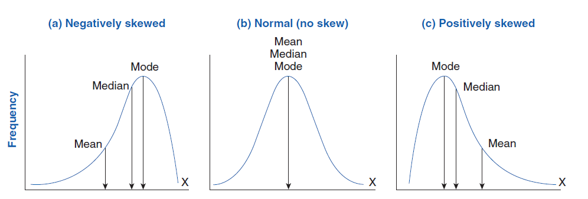

# Yaser Kassam
## Student at Bellevue University
- Earning his master's degree in Data Science
## Discovering Statistics Using R Page 30 Tasks 3-5
### Task 3:
a. This is a discrete variable because the number of downloads are whole numbers that go from 0 and up.

b. This is a nominal variable because there are more than two categories of band names and also their names holds no order in ranking.

c. This is an ordinal variable because you are finding their position on the ITunes chart and the positions are rankings.

d. This is a ratio variable because money is continuous, but also they attribute to a similar relationship such as a band making $100 vs another making $200 this means they made double them. When, is one band makes $200 and another makes $400 this is the same relationship saying they made double them.

e. This is also a ratio variable because the drugs are contiuous because they can be broken down infinitely and also they have a relationship. Where, one band had 2 lbs of drugs and another had 4 lbs. It is the same relationahip as one having 1 lbs vs 2 lbs. In both cases one had double the amount as the other.

f. This would be a nominal variable because each drug is a category and there are more than two categories.

g. This would be a nominal variable because each phone number is one category and there are going to be more than for categories. Also, it wouldn't be oridnal because the number 9876543210 is not a higher ranking then 9876543209.

h. This would be a binary variable because yes we are looking at phone numbers which there can be many the variable we are looking at is gender which is either male or female.

i. This would be nominal because each instruments are a category and there are more than two instruments that are played for bands.

j. This would be a ratio variable time is contiunous and there is the same type of relationship between 1 second to 2 secs as there is for 2 sec to 4 secs.

### Task 4:
- Measurement error is the difference between what is the actual and what is being measured. So the actual value is 857 Cds and the measured value is what the computer program scanned using the webcam of 863. So, the measurement error is 6 because this is the difference between the actual 857- the measured 863.

### Task 5:
- Below is the graphs of what a positively skewed distribution, normal distribution, and negatively skewed distribution.

